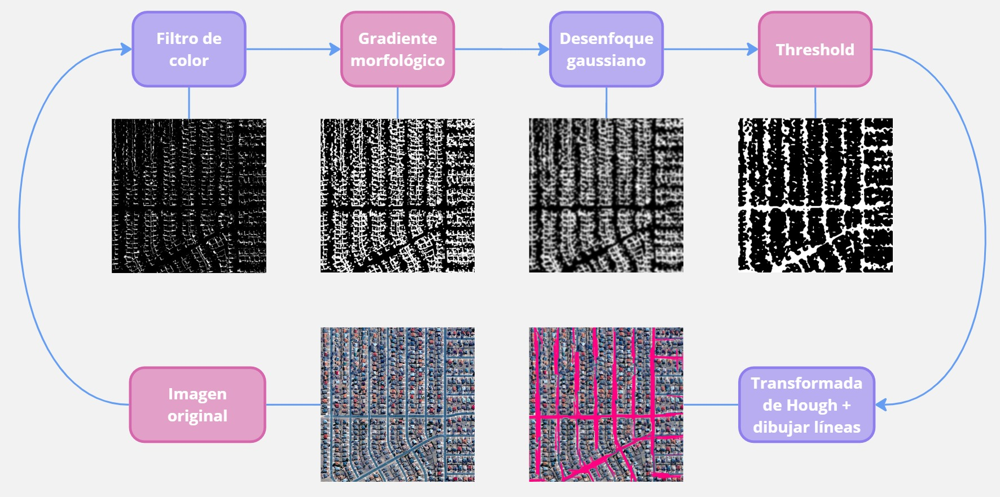
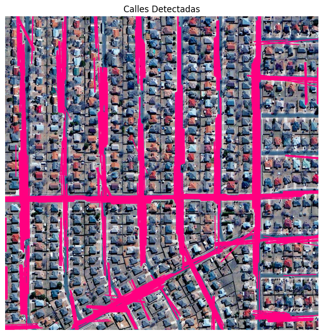

# 🚀 Detección de Calles y Caminos en Imágenes Satelitales

Este proyecto utiliza **OpenCV y NumPy** para procesar una imagen satelital y detectar calles mediante la **Transformada de Hough**. Fue desarrollado en **Google Colab**.


## 🔍 Características



Diagrama de bloques.

- Conversión a escala de grises.

- Detección de regiones oscuras (posibles calles).

- Aplicación de filtros morfológicos. 

- Transformada de Hough para detección de líneas.

- Visualización de los resultados con Matplotlib.


## 🛠️ Requisitos

- Python 3.x

- OpenCV (`cv2`)

- NumPy

- Matplotlib


## 📂 Estructura del Proyecto

```
/SatelliteImage
│── satelite2.jpg     # Imagen de entrada
│── ImageProc.py      # Script de procesamiento de imagen
│── README.md         # Este archivo
```


## 🖼️ Resultado

El script generará una imagen con las calles detectadas resaltadas con líneas de color rosa.



Ejemplo de ejecuión
